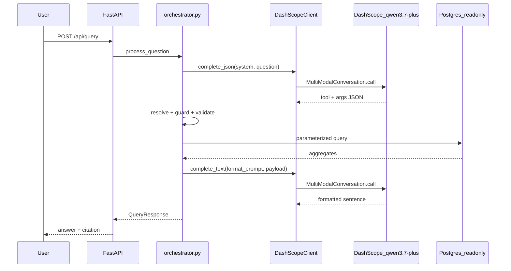

# DashScope Cloud LLM — Implementation Plan

Branch: **`fa/cloud-dev`**

## Goal

Move from local Ollama (`qwen3.5:2b`) to cloud **DashScope `qwen3.7-plus`**, giving users real-time answers (~2–5s/query vs 5–90s on CPU). The database, validation layer, faithfulness guard, auth, and sessions stay local and unchanged.

## Architecture



**Privacy boundary (updated product framing):**
- Sent to DashScope: question text, static system prompt, aggregated results (counts, sums, top-N labels)
- Never sent: DB credentials, raw row dumps, session tokens
- `list_orders` payloads are capped/sampled before egress (total + first 3 rows max)

## Why `MultiModalConversation` (not `Generation`)

Per DashScope docs, **`qwen3.7-plus` is a multimodal-series model** and must use `MultiModalConversation.call()` even for text-only requests. Your sample is the correct API surface:

```python
dashscope.base_http_api_url = "https://dashscope-intl.aliyuncs.com/api/v1"
MultiModalConversation.call(
    api_key=...,
    model="qwen3.7-plus",
    messages=[{"role": "user", "content": [{"text": "..."}]}],
)
```

Text-only messages use `content: [{"text": "..."}]` — never plain strings.

**JSON tool calls:** pass `response_format={"type": "json_object"}` and keep `"JSON"` in the system prompt (DashScope requirement). **`enable_thinking` must be `False`** — JSON mode is incompatible with thinking mode.

**Async note:** the `dashscope` SDK is synchronous. Wrap calls in `anyio.to_thread.run_sync` (same pattern as argon2 in [`backend/auth.py`](backend/auth.py)) so the FastAPI event loop is not blocked.

---

## Phase M1 — Model client + tool translation

### 1. New package: `backend/model_client/`

| File | Purpose |
|------|---------|
| [`backend/model_client/__init__.py`](backend/model_client/__init__.py) | `get_model_client()` singleton, configured at startup |
| [`backend/model_client/dashscope_client.py`](backend/model_client/dashscope_client.py) | `DashScopeClient` implementation |

**Interface:**

```python
class DashScopeClient:
    async def complete_json(self, system: str, user: str, *, temperature: float = 0) -> str
    async def complete_text(self, system: str, user: str, *, temperature: float = 0.3) -> str
    async def health_check(self) -> bool
```

**Internal helpers in `dashscope_client.py`:**
- `_configure_dashscope()` — set `dashscope.base_http_api_url` once from config
- `_text_messages(system, user)` — build multimodal-format message list
- `_extract_text(response)` — parse `response.output.choices[0].message.content[0]["text"]`
- `_call(...)` — shared `MultiModalConversation.call` with timeout, HTTP status check, error mapping

Retry and JSON extraction (`_extract_json` from [`backend/orchestrator.py`](backend/orchestrator.py) lines 370–391) stay in the orchestrator layer, not inside the client.

### 2. Config swap — [`backend/config.py`](backend/config.py)

**Remove:**
- `ollama_base_url`, `ollama_model`

**Add:**
```env
DASHSCOPE_API_KEY=sk-...
DASHSCOPE_BASE_URL=https://dashscope-intl.aliyuncs.com/api/v1
DASHSCOPE_MODEL=qwen3.7-plus
DASHSCOPE_ENABLE_THINKING=false
LLM_TIMEOUT_SECONDS=30        # was 90 for CPU Ollama
LLM_MAX_ATTEMPTS=2
```

**Production boot guard** (mirror existing `SESSION_SECRET` check in [`backend/main.py`](backend/main.py) startup):
- Refuse boot when `ENVIRONMENT=production` and `DASHSCOPE_API_KEY` is missing/empty

Update [`.env.example`](.env.example) accordingly (remove Ollama section, add DashScope section).

### 3. Orchestrator — swap `call_llm_for_tool`

In [`backend/orchestrator.py`](backend/orchestrator.py), replace the inline `httpx` Ollama POST (lines 394–449) with:

```python
content = await get_model_client().complete_json(system_prompt, question, temperature=0)
return _extract_json(content)
```

Keep existing retry loop (temp 0 → 0.4 on retry). Keep Layer 1 translation cache unchanged in behavior.

### 4. Cache key — [`backend/cache.py`](backend/cache.py)

Change `translation_key` default model from `settings.ollama_model` → `settings.dashscope_model` (line 111). Update [`backend/tests/test_cache.py`](backend/tests/test_cache.py) reference.

### 5. Health check — [`backend/main.py`](backend/main.py)

Replace `check_llm_health()` (Ollama `/api/tags`) with `DashScopeClient.health_check()` — a minimal `complete_text` ping or models availability call. `/api/health` contract unchanged: `{"db": "ok", "llm": "ok"}`.

### 6. Dependency — [`backend/requirements.txt`](backend/requirements.txt)

Add: `dashscope>=1.26.0`

**M1 exit check:** With Ollama stopped, `"How many delivered orders in São Paulo last month?"` returns correct `count_orders` + filters. Answers still use deterministic templates (format step comes in M2).

---

## Phase M2 — Cloud answer formatting

### 1. New function: `call_llm_for_format`

Add to [`backend/orchestrator.py`](backend/orchestrator.py):

```python
async def call_llm_for_format(
    question: str, tool_name: str, filters: dict, result: dict
) -> str
```

**System prompt (fixed, short):**
> You are a data assistant. Given a query operation, filters, and database result, write ONE clear sentence answering the user's question. Use the exact numbers from the result — never estimate. Keep it under 2 sentences.

**User payload (JSON string):**
```json
{"question": "...", "operation": "count_orders", "filters": {...}, "result": {...}}
```

**Result sanitization** (new helper `_sanitize_result_for_llm`):
- `list_orders`: send `{total_count, showing, sample: orders[:3]}` only
- `top_products`: send capped list (already ≤25)
- All others: send as-is (already aggregates)

Call `complete_text(...)` — no `response_format`.

### 2. Update `format_answer`

Change [`format_answer`](backend/orchestrator.py) (lines 504–565) to:
1. Try `call_llm_for_format(question, tool_name, filters, result)`
2. On any failure (timeout, empty response, API error) → **fallback** to existing deterministic templates

Pass `question` into `format_answer` from `process_question` (signature change: add `question: str` param).

**M2 exit check:** Same query returns a natural-language sentence from the cloud model; `result.count` remains the authoritative number regardless of prose quality.

---

## Phase M3 — Tests, docs, audit

### Tests (new/updated)

| File | What it pins |
|------|--------------|
| `backend/tests/test_model_client.py` | Message shape, JSON mode params, text extraction, error handling (mock `MultiModalConversation.call`) |
| `backend/tests/test_format_cloud.py` | Cloud format success + fallback to templates on failure |
| `backend/tests/test_cache.py` | Update model name in cache key test |
| Existing eval harness | Re-run `eval_set.json` — expect pass rate ≥95% (up from 94% with 2B local model) |

All unit tests mock DashScope — no API key required in CI.

### Docs

- [`README.md`](README.md): remove Ollama setup (sections 3, prerequisites); add DashScope API key setup; update architecture diagram model name; add privacy note ("questions and summary results sent to Alibaba Cloud")
- [`model_serving_plan.md`](model_serving_plan.md): graduate from stub — document DashScope as the model tier; note `format_answer` is now a second cloud call (contradicts current stub text)
- [`CLAUDE.md`](CLAUDE.md): update model serving line from Ollama to DashScope for this branch

### Audit (optional, low effort)

Extend [`backend/audit.py`](backend/audit.py) `build_record` with:
- `llm_provider: "dashscope"`
- `llm_model: settings.dashscope_model`

No token counts in v1 unless DashScope response exposes them cleanly.

---

## Files changed (summary)

| Action | File |
|--------|------|
| **Create** | `backend/model_client/__init__.py`, `backend/model_client/dashscope_client.py` |
| **Create** | `backend/tests/test_model_client.py`, `backend/tests/test_format_cloud.py` |
| **Modify** | `backend/orchestrator.py`, `backend/config.py`, `backend/main.py`, `backend/cache.py` |
| **Modify** | `backend/requirements.txt`, `.env.example`, `README.md` |
| **Modify** | `backend/tests/test_cache.py`, `model_serving_plan.md` |

No frontend changes required for v1 (no streaming). The existing chat panel works unchanged.

---

## Config reference (`.env` for cloud dev)

```env
DASHSCOPE_API_KEY=sk-your-key-here
DASHSCOPE_BASE_URL=https://dashscope-intl.aliyuncs.com/api/v1
DASHSCOPE_MODEL=qwen3.7-plus
DASHSCOPE_ENABLE_THINKING=false
LLM_TIMEOUT_SECONDS=30
LLM_MAX_ATTEMPTS=2
LLM_CACHE_ENABLED=true
```

---

## Risks and mitigations

| Risk | Mitigation |
|------|------------|
| JSON mode fails with thinking enabled | `DASHSCOPE_ENABLE_THINKING=false` hardcoded for tool calls |
| Sync SDK blocks event loop | `anyio.to_thread.run_sync` wrapper |
| Cloud format hallucinates numbers | `result` field in API response is always from DB; format is cosmetic; deterministic fallback on error |
| API cost from `/api/eval` | Already auth-gated; ~100 LLM calls per eval run |
| Region mismatch on API key | Use intl URL (`dashscope-intl.aliyuncs.com`) for keys created on international console |

---

## Estimated effort

- **M1** (client + tool swap + health): ~1 day
- **M2** (cloud formatting + fallback): ~1 day
- **M3** (tests + docs): ~0.5 day

**Total: ~2.5 days** on `fa/cloud-dev`.
