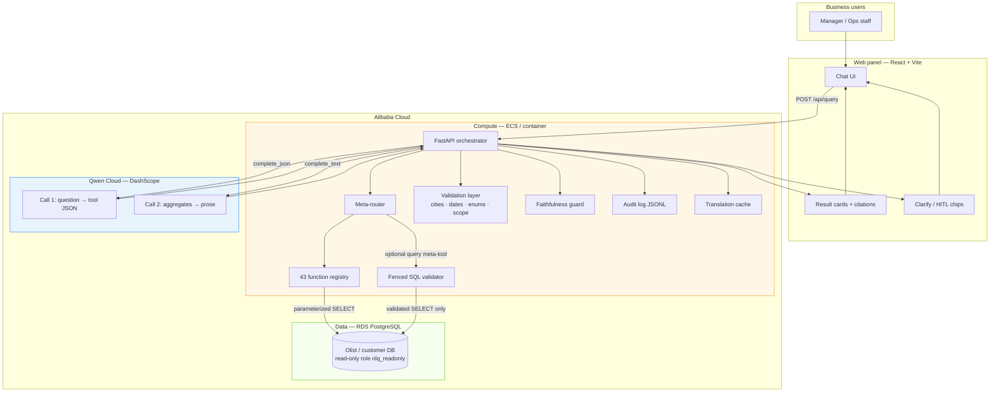
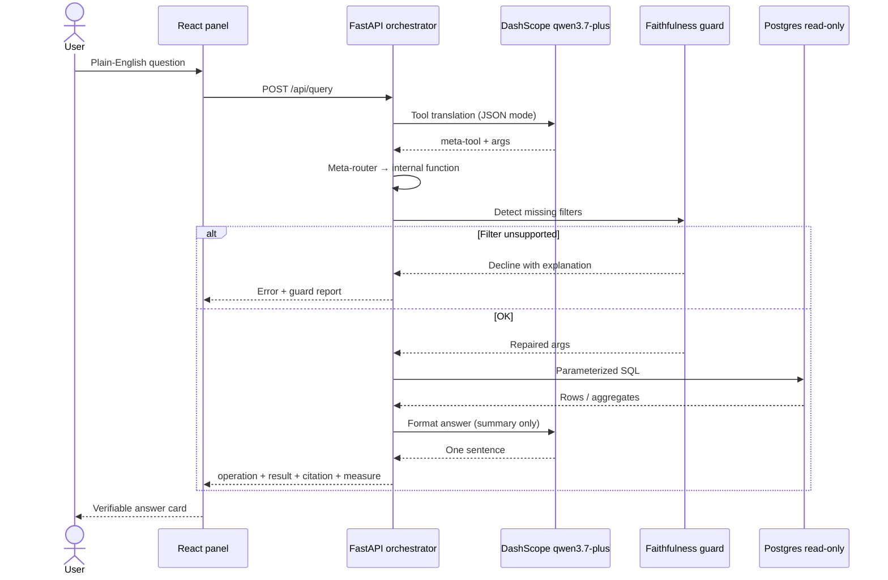
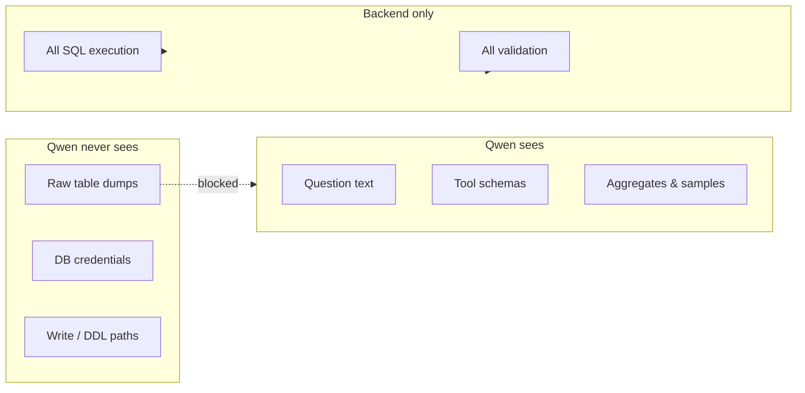

# Qwen Cloud Hackathon Submission

**Project name:** Verifiable Query — Autopilot Analyst for Operational Data  
**Track:** [Track 4 — Autopilot Agent](https://qwenlm.github.io/blog/qwen-cloud-hackathon/)  
**Repository:** https://github.com/farhanmatics/nl-query-layer-olist  
**Demo video:** *(add YouTube/Vimeo link — ~3 minutes)*  
**Blog post (optional):** *(add URL if eligible for Blog Post Prize)*

---

## One-line pitch

An **autopilot analyst** that turns plain-English business questions into **exact, citable answers** from a live operational database — powered by **Qwen Cloud (DashScope)** for intent and narration, with a **production-grade backend** that owns all SQL, validation, and trust controls.

---

## Problem & workflow automated

Operations and finance teams routinely depend on analysts for ad-hoc questions:

> *"How many delivered orders in São Paulo last month?"*  
> *"What's our revenue by state this year?"*  
> *"Which is the best product in perfumaria last year?"*

Traditional paths are slow (analyst queue), brittle (self-serve BI misses the long tail), or risky (chatbots that guess numbers).

**This project automates the analyst workflow end-to-end:**

1. **Intake** — ambiguous natural-language question (chat UI or API)
2. **Interpretation** — Qwen maps question → structured tool call (meta-tool shape + filters)
3. **Validation** — backend normalizes cities, dates, enums; faithfulness guard repairs or declines dropped filters
4. **Execution** — parameterized SQL against Postgres (read-only role); optional fenced SQL escape for long tail
5. **Delivery** — structured result card + citation + one-sentence answer formatted by Qwen
6. **Human checkpoint** — clarify prompts when intent is ambiguous; hard decline when a filter cannot be applied honestly

The database **never** leaves your infrastructure. Qwen sees question text and capped aggregates — not raw row dumps.

---

## Why Track 4 (Autopilot Agent)

| Hackathon criterion | How this project demonstrates it |
|---------------------|----------------------------------|
| Real-world business workflow | Replaces analyst/BI ad-hoc query loop for operational metrics |
| Ambiguous inputs | Entity disambiguation (catalog products vs orders sold), typo-tolerant city matching, relative dates on historical data |
| External tools | 43 internal SQL functions, 7 meta-tools, optional `query` SQL escape hatch |
| Human-in-the-loop | Clarify chips; faithfulness guard refuses confident wrong answers |
| Production-readiness | Read-only DB role, statement timeouts, row caps, rate limits, audit JSONL, 67-case live eval harness |

---

## Qwen Cloud integration

| Step | Model | Input | Output |
|------|-------|-------|--------|
| **Tool translation** | `qwen3.7-plus` via DashScope `MultiModalConversation` | System prompt + meta-tool schemas + user question | JSON `{ "tool", "args" }` |
| **Answer formatting** | Same model | Operation, filters, sanitized result summary | One natural-language sentence |

**Implementation:** `backend/model_client/dashscope_client.py`  
**Config:** `DASHSCOPE_API_KEY`, `DASHSCOPE_MODEL=qwen3.7-plus`, `DASHSCOPE_BASE_URL`

**Design choices for reliability with Qwen:**

- **Meta-tool layer** (`META_TOOLS_ENABLED`) — LLM picks 7–8 shapes (`count`, `rank`, `sum`, `list`, `breakdown`, `compare`, `lookup`, optional `query`); backend routes to 43 internal executors. Reduces routing errors vs exposing the full catalog.
- **Translation cache** — caches question → tool call only; every answer still hits live Postgres.
- **Faithfulness guard** — deterministic repair/decline when Qwen drops filters present in the question.
- **Result sanitization** — only aggregates/samples sent to Qwen for formatting; never unbounded row sets.

---

## Architecture

### System diagram

> **PNG for slides:** see [docs/mermaid-png-export-guide.md](docs/mermaid-png-export-guide.md)



### Request sequence



### Trust boundary



---

## Key features (demo highlights)

1. **Faithful counts** — city, state, status, date filters validated before query; guard auto-applies dropped filters when safe.
2. **Catalog vs orders** — *"How many products in perfumaria?"* vs *"How many perfumaria orders?"* routes to `count_products` vs `count_by_category`.
3. **Multi-turn follow-ups** — *"How many products in perfumaria?"* → *"Which is the best one last year?"* inherits category across meta-tool switches.
4. **Rankings & breakdowns** — top products/sellers, revenue by state, order status histogram, state comparisons.
5. **Honest decline** — unknown cities, unsupported concepts (returns/profit), or filters a tool cannot apply.
6. **SQL escape hatch (Phase 4)** — long-tail `query` meta-tool with SELECT-only fence, allowlisted tables, mandatory LIMIT.
7. **Audit trail** — every request logged with operation, filters, latency (no secrets).
8. **Planner chains** — 2-step plans with `$step0.category` bindings; UI shows step trace ([docs/mcp-demo.md](docs/mcp-demo.md)).
9. **MCP server** — `health_check`, `eval_summary`, `count_orders` tools for external agent integration.

---

## Alibaba Cloud deployment

> **Submission requirement:** Backend must run on Alibaba Cloud. Replace placeholders below before judging.

| Component | Alibaba service | Purpose |
|-----------|-----------------|--------|
| API + orchestrator | **ECS** *(or ACK)* | FastAPI, Python 3.9+ |
| Operational database | **RDS PostgreSQL** *(or ECS-hosted Postgres)* | Olist / customer data, read-only role |
| LLM inference | **DashScope / Qwen Cloud** | `qwen3.7-plus` tool + format calls |
| Secrets | **KMS / env injection** | `DASHSCOPE_API_KEY`, `DB_URL` |

**Proof artifacts to add before submit:**

1. `docs/alibaba-cloud-deployment.md` — instance IDs, region, security groups, env wiring
2. Short screen recording — ECS console + `curl /api/health` showing `db: ok`, `llm: ok`
3. Code reference — `backend/model_client/dashscope_client.py` (DashScope API), deployment Terraform/scripts if any

**Health endpoint (post-deploy):**

```bash
curl https://<your-api-host>/api/health
# {"db":"ok","llm":"ok","meta_tools":"enabled","sql_escape":"enabled",...}
```

---

## Tech stack

| Layer | Technology |
|-------|------------|
| LLM | Alibaba DashScope — **Qwen 3.7 Plus** |
| Backend | Python · FastAPI · asyncpg |
| Frontend | React · TypeScript · Vite · Tailwind |
| Database | PostgreSQL (read-only role, statement timeout) |
| Auth / sessions | SQLite app state (durable chat history) |
| Eval | 67 live cases + offline meta-router / SQL guard tests |

**Branch:** `fa/cloud-dev`

---

## Running locally (judges)

See [README.md](README.md). Minimal path:

```bash
# 1. Postgres with Olist loaded + nlq_readonly role
# 2. .env with DASHSCOPE_API_KEY, META_TOOLS_ENABLED=true
cd backend && ../venv/bin/uvicorn main:app --port 8000
cd frontend && npm run dev
```

**Live eval (optional):**

```bash
cd backend && API_URL=http://127.0.0.1:8000 ../venv/bin/python tests/test_eval.py
```

---

## Demo video

Record using [docs/hackathon-demo-script.md](docs/hackathon-demo-script.md) (~3 minutes).  
Upload to YouTube/Vimeo/Facebook (public) and paste URL at the top of this file.

**Suggested title:** *Verifiable Query — Qwen-powered autopilot analyst (Track 4)*

---

## Submission checklist

- [ ] Public GitHub repo URL in this file
- [ ] `LICENSE` file visible in repo About (MIT) — [`LICENSE`](../LICENSE)
- [ ] Architecture diagram (above — export PNG via [docs/mermaid-png-export-guide.md](docs/mermaid-png-export-guide.md))
- [ ] ~3 min demo video URL
- [ ] Alibaba Cloud deployment proof (`docs/alibaba-cloud-deployment.md` + recording)
- [ ] Track 4 identified in submission form
- [ ] Optional: blog/social post URL

---

## Team & license

*(Add team names / contact)*

Open source: **MIT** (see [README.md](README.md#license)).

---

**Built for Track 4:** automate the analyst workflow with Qwen Cloud for intelligence and a local backend for truth.
