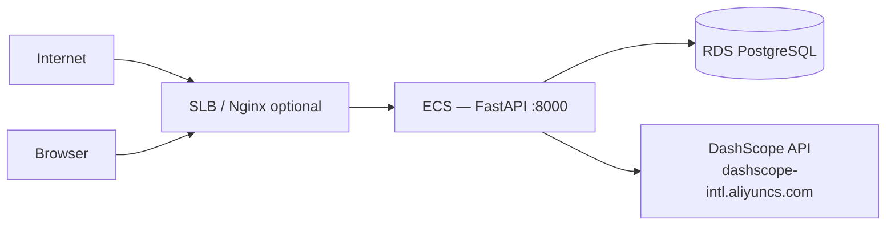

# Alibaba Cloud Deployment — Hackathon Proof

> **Action required before submission:** Fill in the placeholders below, deploy the stack, and attach a short screen recording showing ECS/RDS + a live `/api/health` response.

This document satisfies the hackathon requirement to demonstrate backend use of **Alibaba Cloud services and APIs**.

---

## Services used

| Service | Alibaba product | Role in this project |
|---------|-----------------|----------------------|
| LLM inference | **DashScope (Qwen Cloud)** | base `qwen3.6-flash` + fine-tuned `qwen3-14b` — tool translation + answer formatting |
| Model fine-tuning | **Model Studio** | SFT/LoRA training of `qwen3-14b` on the Olist schema; deployed as inference service `qwen3-14b-a88c9bdd64ef` |
| Application host | **ECS** *(fill: instance ID)* | FastAPI orchestrator + React static assets (or separate OSS/CDN) |
| Database | **RDS PostgreSQL** *(fill: instance ID)* | Olist / operational data; `nlq_readonly` role for app |
| Secrets | Environment variables / **KMS** *(optional)* | `DASHSCOPE_API_KEY`, `DB_URL`, `SESSION_SECRET` |

**Region:** *(e.g. ap-southeast-1)*  
**ECS instance ID:** `i-xxxxxxxx`  
**RDS instance ID:** `rm-xxxxxxxx`  
**Model Studio fine-tune job:** `ft-202607030621-4254` → deployment `qwen3-14b-a88c9bdd64ef`

---

## Code references (Alibaba APIs)

### DashScope / Qwen Cloud

The backend calls DashScope via the official Python SDK:

- **File:** [`backend/model_client/dashscope_client.py`](../backend/model_client/dashscope_client.py)
- **API:** base model via `MultiModalConversation.call`; fine-tuned `qwen3-14b` via `Generation.call` (text). `response_format: json_object` for tool calls.
- **Config:** `DASHSCOPE_BASE_URL`, `DASHSCOPE_MODEL=qwen3.6-flash`, `DASHSCOPE_FINETUNE_MODEL=qwen3-14b-a88c9bdd64ef`, `USE_FINETUNED_MODEL`, `DASHSCOPE_API_KEY`

```python
# Excerpt — DashScope client configuration
import dashscope
from dashscope import MultiModalConversation

dashscope.base_http_api_url = settings.dashscope_base_url
# MultiModalConversation.call(model=settings.dashscope_model, ...)
```

### Health check (verifies DB + Qwen connectivity)

```bash
curl https://<your-api-domain>/api/health
```

Expected:

```json
{
  "db": "ok",
  "llm": "ok",
  "llm_model": "qwen3-14b-a88c9bdd64ef",
  "meta_tools": "enabled",
  "sql_escape": "enabled",
  "planner": "enabled",
  "finetuned": "enabled",
  "timestamp": "..."
}
```

---

## Deployment topology



---

## Environment on ECS

Copy from [`.env.example`](../.env.example). Minimum production set:

```bash
DASHSCOPE_API_KEY=<from Model Studio>
DASHSCOPE_MODEL=qwen3.6-flash
DASHSCOPE_FINETUNE_MODEL=qwen3-14b-a88c9bdd64ef  # deployed SFT model on Model Studio
USE_FINETUNED_MODEL=false  # flip to true to serve the fine-tune
DASHSCOPE_BASE_URL=https://dashscope-intl.aliyuncs.com/api/v1

DB_URL=postgresql://nlq_readonly:<password>@<rds-host>:5432/olist
META_TOOLS_ENABLED=true
SQL_ESCAPE_ENABLED=true
ENVIRONMENT=production
COOKIE_SECURE=true
SESSION_SECRET=<strong-random>
ALLOWED_ORIGINS=https://<your-frontend-domain>
```

**Start command:**

```bash
cd backend && uvicorn main:app --host 0.0.0.0 --port 8000
```

---

## Security groups (minimum)

| Direction | Port | Source | Purpose |
|-----------|------|--------|---------|
| Inbound | 443 or 8000 | 0.0.0.0/0 *(or judge IP)* | API / demo |
| Inbound | 5432 | ECS security group only | RDS — not public |
| Outbound | 443 | 0.0.0.0/0 | DashScope HTTPS |

---

## Recording checklist (separate from demo video)

Record ~30–60 seconds showing:

1. Alibaba Cloud console — ECS instance **Running**
2. RDS instance **Running** (optional: connection string redacted)
3. SSH or Cloud Shell on ECS — `curl localhost:8000/api/health`
4. **Model Studio console** — the fine-tune job `ft-202607030621-4254` and the
   **Running** deployment `qwen3-14b-a88c9bdd64ef` (proves the Qwen fine-tune)
5. *(Optional)* DashScope console showing API key region

Upload recording to YouTube (unlisted is fine) and link here:

**Deployment proof video:** *(URL)*

---

## Terraform / scripts

*(Add paths if you automate provisioning, e.g. `deploy/ecs-user-data.sh`)*

- [ ] `deploy/` scripts committed
- [ ] README link to this doc from `HACKATHON.md`
